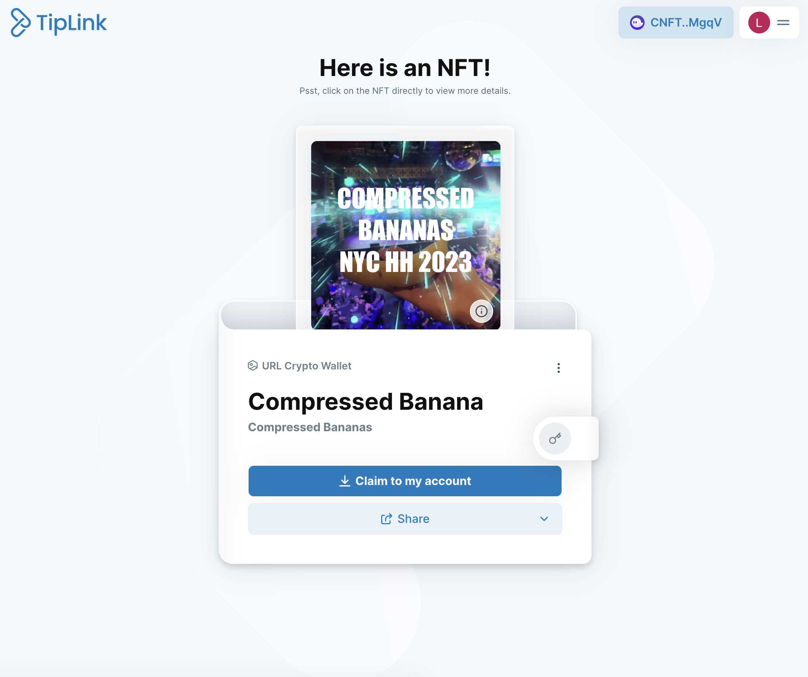

# Sveltekit / Compressed NFTs / TipLinks

Mint compressed NFTs to TipLink wallets using a Sveltekit UI.

🔗 https://cbananas.com

♥️ Special thanks to [@HeyAndyS](https://twitter.com/HeyAndyS), [TipLink](https://tiplink.io), [Helius](https://helius.xyz)

#### Resources

-   [cNFTs] https://www.youtube.com/watch?v=83nIhnxtlW8
-   [cNFTs] https://github.com/loopcreativeandy/video-tutorial-resources/tree/main/cnfts
-   [SvelteKit] https://kit.svelte.dev/

## Start Dev Server

-   `npm i`
-   `npm run dev`

### Mint Route (`/mint`)

-   Generates TipLink wallet.
-   Mints NFT to TipLink wallet.

### Included Setup Routes (`/setup/*`)

There are a couple routes in `/setup` that are handy when initially creating your collection account and merkle tree.

